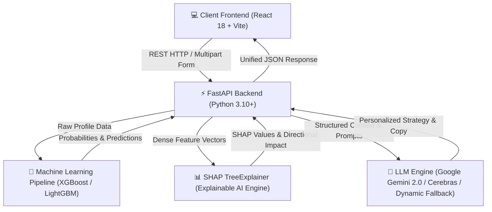

# 🛡️ ChurnShield One — System Documentation & Technical Blueprint

**ChurnShield One** is an enterprise-grade, agentic AI platform designed for proactive customer churn prediction, SHAP-driven explainability, and dynamic retention strategy generation across multiple industries (**Telecom**, **OTT Streaming**, and **Banking & Financial Services**).

---

## 📌 Table of Contents
1. [System Architecture & Data Flow](#1-system-architecture--data-flow)
2. [API Specification & Endpoints](#2-api-specification--endpoints)
3. [Setup & Deployment Guide](#3-setup--deployment-guide)
4. [Feature Breakdown & Capability Matrix](#4-feature-breakdown--capability-matrix)

---

# 1. System Architecture & Data Flow

ChurnShield One is built on a decoupled, microservices-ready architecture comprising a reactive Single Page Application (SPA) frontend, a high-performance FastAPI backend, specialized Machine Learning pipelines (`.pkl`), and a hybrid LLM engine powered by Google Gemini 2.0.



### 🏗️ Technology Stack

| Layer | Technology / Library | Purpose |
| :--- | :--- | :--- |
| **Frontend UI** | React 18, Vite, Lucide Icons, Recharts, Axios | Responsive Single Page Application with dynamic dashboards and charts. |
| **Styling** | Vanilla CSS3, Google Fonts (Inter), CSS Variables | Modern glassmorphism design system with responsive breakpoints. |
| **Backend API** | FastAPI, Uvicorn, Pydantic v2 | Asynchronous RESTful API framework with input validation. |
| **Machine Learning** | Scikit-Learn, XGBoost, LightGBM, Joblib | Pre-trained classification models per industry. |
| **Explainable AI (XAI)** | SHAP (SHapley Additive exPlanations) | Feature attribution analysis for local model interpretability. |
| **LLM Engine** | Google Gemini 2.0 Flash / REST API / Cerebras LLaMA 3.3 | Contextual retention strategy and personalized multi-channel copy generation. |

### 🔄 End-to-End Processing Pipeline

1. **Data Ingestion**: Accepts individual customer payloads via JSON or bulk dataset CSV files (`telecom_churn_dataset.csv`).
2. **Dynamic Preprocessing**: Maps input attributes, imputes missing values, and applies one-hot encoding using industry-specific `.pkl` preprocessors.
3. **Inference & Risk Scoring**: Classifies churn probability ($0.0 \rightarrow 1.0$) and categorizes risk into **CRITICAL** ($\ge 85\%$), **HIGH** ($60-84\%$), **MEDIUM** ($30-59\%$), or **LOW** ($< 30\%$).
4. **SHAP Feature Attribution**: Computes exact Shapley values for each feature vector, determining directional impact (**▲ Churn Risk** vs **▼ Protective Factor**).
5. **Attribute Aggregation**: Merges one-hot encoded categorical dummies back to primary domain attributes (e.g., `Contract_Month-to-Month` $\rightarrow$ `Contract`).
6. **Strategy & Communication Synthesis**: Feeds exact customer numbers, risk tier, and top SHAP drivers to Google Gemini to construct actionable strategies and multi-channel copy.

---

# 2. API Specification & Endpoints

**Base URL**: `http://localhost:8000`  
**CORS Allowed**: `*`

### 1️⃣ Health Check
* **GET** `/`
* **Response**:
```json
{
  "status": "online",
  "platform": "ChurnShield One",
  "supported_industries": ["telecom", "ott", "banking"],
  "llm": {
    "provider": "google",
    "configured": true,
    "model": "gemini-2.0-flash"
  }
}
```

---

### 2️⃣ Single Customer Prediction
* **POST** `/predict`
* **Request Body**:
```json
{
  "industry": "telecom",
  "customer_id": "CUST-MANUAL-001",
  "data": {
    "Age": 35,
    "Tenure in Months": 5,
    "Contract": "Month-to-Month",
    "Monthly Charge": 85.0,
    "Satisfaction Score": 2,
    "Number of Referrals": 0
  }
}
```
* **Response**: Returns `churn_probability`, `risk_level`, `financial_exposure`, and top 8 primary `top_drivers` with relative importance percentages.

---

### 3️⃣ Bulk CSV Dataset Upload
* **POST** `/bulk_predict`
* **Content-Type**: `multipart/form-data`
* **Form Fields**: `file` (CSV file), `industry` (`telecom` | `ott` | `banking`)
* **Behavior**: Scans raw CSV columns dynamically, processes all customer rows through model pipelines, computes batch SHAP explanations, and returns dataset summary statistics with full row predictions.

---

### 4️⃣ AI Retention Strategy Generation
* **POST** `/strategy`
* **Request Body**:
```json
{
  "customer_id": "CUST-MANUAL-001",
  "industry": "telecom",
  "risk_level": "CRITICAL",
  "churn_probability": 0.998,
  "top_drivers": [
    { "feature": "Satisfaction Score", "impact": 6.43, "feature_value": 2, "importance": 85.2, "direction": "churn" }
  ],
  "profile": { "Monthly Charge": 85.0, "Contract": "Month-to-Month" }
}
```
* **Response Schema**:
```json
{
  "summary": "3-4 sentence plain English explanation of risk and strategy",
  "risk_explanation": "Specific explanation of top SHAP driver",
  "risk_drivers": [{ "feature": "Satisfaction Score", "value": "2", "reason": "Drives churn risk." }],
  "protective_factors": [{ "feature": "Tenure in Months", "value": "5", "reason": "Reduces churn likelihood." }],
  "recommendation": "Headline retention offer",
  "recommendations": ["Actionable step 1", "Actionable step 2"],
  "action_items": ["Immediate task 1", "Immediate task 2"],
  "financial_exposure": { "risk_revenue_loss": 1020.0 }
}
```

---

### 5️⃣ Multi-Channel Customer Communication
* **POST** `/communication/generate`
* **Request Body**:
```json
{
  "customer_id": "CUST-MANUAL-001",
  "industry": "telecom",
  "risk_level": "CRITICAL",
  "churn_probability": 0.998,
  "top_drivers": [...],
  "recommendation": "15% Rate Discount Offer",
  "channel": "email",
  "tone": "professional",
  "profile": { "Monthly Charge": 85.0 }
}
```
* **Supported Channels**: `email`, `sms`, `whatsapp`, `call_script`
* **Supported Tones**: `professional`, `empathetic`

---

### 6️⃣ What-If Scenario Simulation
* **POST** `/simulate`
* **Request Body**:
```json
{
  "industry": "telecom",
  "original_data": { "Contract": "Month-to-Month", "Monthly Charge": 85.0 },
  "modified_data": { "Contract": "Two Year", "Monthly Charge": 72.25 }
}
```
* **Response**: Returns original vs. simulated churn probabilities, risk level transitions, and exact percentage point improvements.

---

# 3. Setup & Deployment Guide

### 📋 Prerequisites
- **Python**: Version 3.10 or higher
- **Node.js**: Version 18.0 or higher
- **Package Managers**: `pip` (Python) and `npm` (Node)

---

### ⚙️ Step 1: Clone Repository & Install Dependencies

```bash
# Clone the repository
git clone https://github.com/RameezP/CODEAMBLE-TZEN1-ChurnShield.git
cd CODEAMBLE-TZEN1-ChurnShield

# 1. Backend Setup
cd backend
python -m venv venv
# On Windows PowerShell:
.\venv\Scripts\Activate.ps1
# On Linux/macOS:
source venv/bin/activate

pip install -r requirements.txt

# 2. Frontend Setup
cd ../frontend
npm install
```

---

### 🔑 Step 2: Environment Configuration

Create a `.env` file in the `backend/` directory:

```env
# Optional Gemini API Key (If omitted, system uses built-in Cerebras/fallback matrix)
GEMINI_API_KEY=your_google_gemini_api_key_here
GEMINI_MODEL=gemini-2.0-flash
PORT=8000
```

---

### 🚀 Step 3: Run Development Servers

**Start Backend API (Terminal 1)**:
```bash
cd backend
python -m uvicorn app.main:app --host 0.0.0.0 --port 8000 --reload
```
*API Documentation available at: `http://localhost:8000/docs`*

**Start Frontend Client (Terminal 2)**:
```bash
cd frontend
npx vite --port 5173
```
*Application available at: `http://localhost:5174` (or allocated port)*

---

# 4. Feature Breakdown & Capability Matrix

```
┌─────────────────────────────────────────────────────────────────────────┐
│                           CHURNSHIELD ONE                               │
├─────────────────────────┬───────────────────────┬───────────────────────┤
│    TELECOM DOMAIN       │      OTT DOMAIN       │    BANKING DOMAIN     │
├─────────────────────────┼───────────────────────┼───────────────────────┤
│ • Monthly Charge        │ • Watch Hours         │ • Credit Limit        │
│ • Contract Type         │ • Inactive Days       │ • Revolving Balance   │
│ • Satisfaction Score    │ • Subscription Tier   │ • Transaction Count   │
│ • Internet Type         │ • Registered Devices  │ • Utilization Ratio   │
└─────────────────────────┴───────────────────────┴───────────────────────┘
```

### 🌟 Core Modules & Features

#### 1. Multi-Industry Intelligence
- Tailored UI schemas, ML models (`.pkl`), and recommendations for **Telecom**, **OTT Streaming**, and **Banking**.
- Seamless one-click switching between industry domains.

#### 2. SHAP Explainability Engine
- Provides transparent **Root-Cause Analysis** instead of black-box predictions.
- Classifies drivers into **🔴 Churn Risk Drivers** (positive SHAP) and **🟢 Protective Factors** (negative SHAP).
- Maps machine learning internal one-hot features cleanly back to user-entered CSV columns.

#### 3. Real-Time Multi-Channel Copywriter
- Generates tailored messages across **Email**, **SMS**, **WhatsApp**, and **Call Scripts**.
- Real-time reactivity: changing channels updates subject lines and body copy instantly.
- Built-in fallback matrix ensures copy generation never crashes even if LLM APIs are offline.

#### 4. Interactive What-If Scenario Simulator
- Enables Customer Success representatives to simulate retention offers (e.g., converting Month-to-Month to 2-Year Contract) before reaching out to the customer.
- Instantly displays predicted churn probability reduction and revenue saved.

#### 5. Universal Responsiveness Design System
- Fully responsive layout adapting seamlessly to **Mobile (320px+)**, **Tablet (768px+)**, **Laptop**, and **Desktop (4K)** displays.
- Touch-friendly controls, responsive form grids, and auto-scrolling tables.
