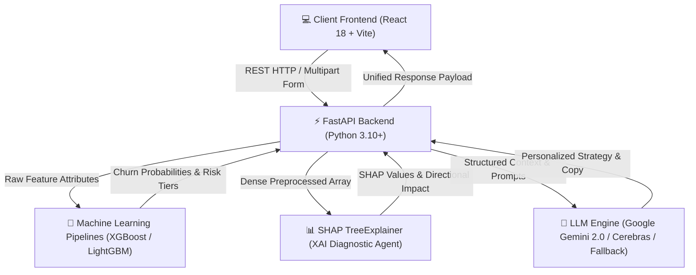

# 🛡️ ChurnShield One — Agentic Customer Retention Intelligence Platform

[](https://fastapi.tiangolo.com/)
[](https://react.dev/)
[](https://vitejs.dev/)
[](https://www.python.org/)
[](https://xgboost.readthedocs.io/)
[](https://ai.google.dev/)

**ChurnShield One** is a multi-industry, agentic AI platform designed for proactive customer churn prediction, SHAP-driven explainable AI (XAI), and dynamic retention strategy synthesis. It transforms raw customer data across **Telecom**, **OTT Streaming**, and **Banking & Financial Services** into actionable, personalized customer outreach strategies.

---

## ✨ Key Capabilities & Highlights

- **🏢 Multi-Industry Domain Adaptability**: Built-in specialized Machine Learning models (`.pkl`) and UI schemas for **Telecom**, **OTT Streaming**, and **Banking**.
- **📊 Transparent SHAP Explainability**: Root-cause analysis identifying **🔴 Churn Risk Drivers** (+SHAP) vs **🟢 Protective Factors** (-SHAP) instead of black-box scores.
- **🧠 Agentic AI Strategy Synthesis**: Generates a 4-part structured retention plan (Executive Summary, Risk Breakdown, Headline Offer, and Action Items) using Google Gemini 2.0.
- **✍️ Real-Time Multi-Channel Copywriter**: Generates personalized outreach copy across **Email**, **SMS**, **WhatsApp**, and **Call Scripts** with instant tone customization (**Professional** & **Empathetic**).
- **🧪 Interactive What-If Scenario Simulator**: Simulates retention offer impact (e.g., converting Month-to-Month to 2-Year Contract) to calculate real-time churn reduction ($\Delta$) and financial savings.
- **📈 Dynamic Bulk CSV Dataset Processing**: Upload any bulk CSV file; the system dynamically extracts custom columns, computes row-level SHAP values, and builds dynamic customer profiles.
- **📱 Universal Responsiveness Design System**: Fluid responsive UI adapting across **Mobile (320px+)**, **Tablet (768px+)**, **Laptop**, and **Desktop (4K)**.

---

## 🏗️ System Architecture



---

## 🤖 Agent Ecosystem

| Agent Name | Location | Primary Responsibility |
| :--- | :--- | :--- |
| **Master Orchestrator Agent** | `backend/app/agent_engine.py` | Coordinates dataset flow between ML, SHAP, Financial, Strategy, and Copywriter agents. |
| **ML Prediction Agent** | `backend/app/model_loader.py` | Preprocesses data, imputes missing fields, predicts churn probabilities ($0.0 \rightarrow 1.0$), and assigns Risk Tiers (**CRITICAL**, **HIGH**, **MEDIUM**, **LOW**). |
| **SHAP XAI Agent** | `backend/app/agent_engine.py` | Computes Shapley feature attributions, directionality, and primary attribute aggregation. |
| **Financial Risk Agent** | `backend/app/recommendation_engine.py` | Calculates monetary revenue at risk (`risk_revenue_loss`). |
| **AI Strategy Agent** | `backend/app/gemini_service.py` | Prompts Gemini 2.0 to formulate structured JSON retention strategies. |
| **Multi-Channel Copywriter Agent** | `backend/app/communication_engine.py` | Synthesizes personalized copy formatted for Email, SMS, WhatsApp, or Call Scripts. |
| **What-If Simulation Agent** | `backend/app/main.py` (`/simulate`) | Calculates real-time churn probability delta ($\Delta$) for proposed account changes. |

---

## 🚀 Quick Start Guide

### 📋 Prerequisites
- **Python**: 3.10 or higher
- **Node.js**: 18.0 or higher
- **Git**

---

### ⚙️ Step 1: Clone Repository

```bash
git clone https://github.com/RameezP/CODEAMBLE-TZEN1-ChurnShield.git
cd CODEAMBLE-TZEN1-ChurnShield
```

---

### 🐍 Step 2: Backend Setup

```bash
cd backend

# Create & activate virtual environment
python -m venv venv
# On Windows PowerShell:
.\venv\Scripts\Activate.ps1
# On Linux/macOS:
source venv/bin/activate

# Install dependencies
pip install -r requirements.txt

# Launch FastAPI server
python -m uvicorn app.main:app --host 0.0.0.0 --port 8000 --reload
```
*Backend API docs available at: `http://localhost:8000/docs`*

---

### 💻 Step 3: Frontend Setup

Open a second terminal window:

```bash
cd frontend

# Install Node dependencies
npm install

# Launch Vite development server
npx vite --port 5173
```
*Frontend application available at: `http://localhost:5174` (or allocated port)*

---

### 🔑 Environment Variables (Optional)

Create a `.env` file in the `backend/` directory:

```env
# Google Gemini API Key (If omitted, system uses built-in Cerebras/fallback matrix)
GEMINI_API_KEY=your_google_gemini_api_key_here
GEMINI_MODEL=gemini-2.0-flash
PORT=8000
```

---

## 🔌 API Endpoints Summary

| Method | Endpoint | Description |
| :--- | :--- | :--- |
| `GET` | `/` | Health check & LLM configuration state |
| `POST` | `/predict` | Single customer manual churn prediction & SHAP attribution |
| `POST` | `/bulk_predict` | Multipart CSV dataset upload & batch scoring |
| `POST` | `/strategy` | AI retention strategy synthesis (structured JSON) |
| `POST` | `/communication/generate` | Multi-channel personalized message generator |
| `POST` | `/simulate` | What-If scenario churn reduction calculator |
| `POST` | `/agent/chat` | Interactive AI customer success advisor chat |

---

## 📁 Repository Structure

```
CODEAMBLE-TZEN1-ChurnShield/
├── backend/
│   ├── app/
│   │   ├── agent_engine.py         # Master Orchestrator Agent & SHAP Aggregator
│   │   ├── communication_engine.py # Multi-Channel Copywriter Proxy
│   │   ├── gemini_service.py       # Google Gemini 2.0 & LLM Integration Engine
│   │   ├── main.py                 # FastAPI Web Server & REST Endpoints
│   │   ├── model_loader.py         # ML Model & Preprocessor Loader (.pkl)
│   │   ├── recommendation_engine.py# Risk Tiering & Financial Exposure
│   │   └── schemas.py              # Pydantic Input/Output Schemas
│   ├── saved_models/               # Pre-trained ML Models per Industry (.pkl)
│   └── requirements.txt            # Python Dependencies
├── frontend/
│   ├── src/
│   │   ├── App.jsx                 # Main React SPA Application & Dashboard UI
│   │   ├── index.css               # Universal Responsive Design System (CSS Variables)
│   │   └── main.jsx                # Entry Point
│   ├── index.html                  # HTML Shell
│   └── package.json                # Node Dependencies & Scripts
├── DOCUMENTATION.md                # 4-Page System Blueprint & Architecture Guide
└── README.md                       # Main Repository Readme
```

---

## 📜 License & Acknowledgments

Built for **CODEAMBLE TZEN1** hackathon. Designed with modern web standards, explainable AI, and agentic AI architectures.
